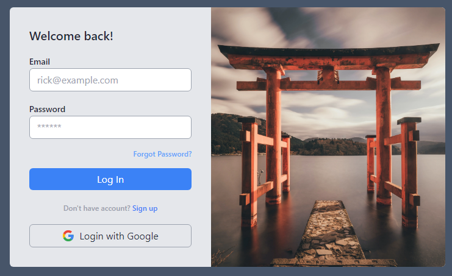

<h1 align="center">Login ~ Register | Firebase Authentication</h1>

## Descripción

 Aplicación realizada con el fin de aprender las cuestiones básicas de la autenticación con Firebase.

## Capturas

## Instalación

- Descargar o clonar el repositorio

`npm install`

- Abrir navegador

`http://localhost:3000/`
